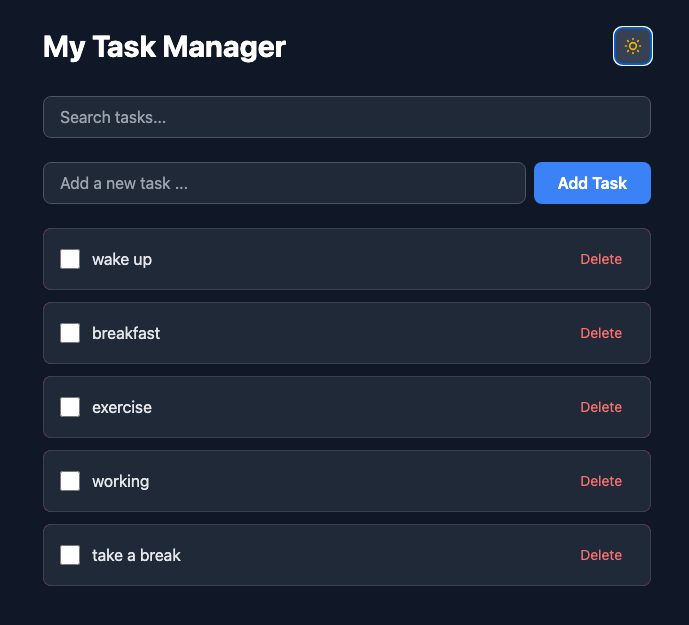

# Task Manager

A responsive task manager developed with React, TypeScript, and Tailwind CSS. It has real-time search, dark mode, and seamless mobile experience.

**Live Demo:** [https://01-taks-manager-2dvu.vercel.app/](https://01-taks-manager-2dvu.vercel.app/)



## Features

- **CRUD Operations** - Create, read, update, and delete tasks
- **Real-time Search** - Debounced search with 500ms delay
- **Dark Mode** - Switch between light and dark theme (persisted)
- **Mobile Optimized** - Swipe-to-delete on mobile
- **Data Persistence** - Tasks saved in localStorage
- **Performance Optimized** - React.memo, useMemo, useCallback
- **Smooth Animations** - Tailwind transitions and transforms
- ️**Error Boundaries** - Simple yet elegant error handling
- **Accessible** - Semantic HTML and keyboard navigation

## Tech Stack

**Frontend:**

- **React 18+** - UI library with hooks
- **TypeScript** - Type safety and better DX
- **Tailwind CSS** - Utility-first styling
- **Vite** - Fast build tool and dev server

**Libraries:**

- **react-swipeable** - Touch gestures for mobile

**Tools:**

- **ESLint** - Code linting
- **Prettier** - Code formatting
- **Git** - Version control
- **Vercel** - Deployment platform

---

## Key Concepts Implemented

### Custom Hooks

- `useLocalStorage` - Persist state to localStorage with sync
- `useDebounce` - Delay state updates for search optimization
- `useDarkMode` - Manage dark mode with system preference detection

### Performance Optimization

- `React.memo` - Prevent unnecessary re-renders of TaskItem
- `useCallback` - Memoize event handlers
- `useMemo` - Memoize filtered task calculations

### Error Handling

- Error Boundaries - Catch and handle component errors gracefully
- Granular boundaries for better UX

### Responsive Design

- Mobile-first approach with Tailwind breakpoints
- Touch interactions (swipe-to-delete) on mobile only
- Click interactions on desktop only

---

## Getting Started

### Prerequisites

- Node.js 18+ installed
- npm or pnpm package manager

### Installation

1. **Clone the repository**

```bash
   git clone https://github.com/devolveo/01-taks-manager.git
   cd 01-taks-manager
```

2. **Install dependencies**

```bash
   npm install
   # or
   pnpm install
```

3. **Start development server**

```bash
   npm run dev
   # or
   pnpm dev
```

4. **Open your browser**

```
   http://localhost:5173
```

### Build for Production

```bash
npm run build
npm run preview
```

---

## Usage

1. **Add Task** - Type in the input field and press Enter or click Add
2. **Complete Task** - Click the checkbox to toggle completion
3. **Delete Task** - Click the delete button (desktop) or swipe left (mobile)
4. **Search Tasks** - Use the search bar to filter tasks in real-time
5. **Dark Mode** - Toggle dark mode with the sun/moon button (persists across sessions)

---

## What I Learned

Building this project helped me master:

- **React Hooks** - Deep understanding of useState, useEffect, useCallback, useMemo
- **Custom Hooks** - Creating reusable logic (useLocalStorage, useDebounce, useDarkMode)
- **TypeScript** - Type safety with interfaces, generics, and proper typing
- **Performance** - When and how to optimize React components
- **Responsive Design** - Mobile-first approach with Tailwind CSS
- **State Management** - Updater functions to prevent race conditions
- **Error Handling** - Error Boundaries to prevent app crashes
- **Debugging** - Chrome DevTools and React DevTools proficiency
- **Deployment** - CI/CD with Vercel

### Key Takeaways

1. **Always use updater functions** when new state depends on previous state
2. **Measure before optimizing** - Don't use React.memo everywhere
3. **Mobile-first** design creates better responsive experiences
4. **localStorage is device-specific** - need backend for cross-device sync
5. **Error Boundaries are essential** for production apps

---

## 🔮 Future Enhancements

Planned features for future versions:

- [ ] **Backend Integration** - Node.js + PostgreSQL for cross-device sync
- [ ] **User Authentication** - Multiple users with their own task lists
- [ ] **Categories/Tags** - Organize tasks by project or category
- [ ] **Due Dates** - Set deadlines with reminders
- [ ] **Priority Levels** - Mark tasks as high/medium/low priority
- [ ] **Drag & Drop** - Reorder tasks with react-beautiful-dnd
- [ ] **Recurring Tasks** - Daily/weekly/monthly task templates
- [ ] **Export/Import** - Download tasks as JSON or CSV
- [ ] **Collaboration** - Share task lists with team members

---

## Author

**Your Name**

- GitHub: [@devolveo](https://github.com/devolveo)
- LinkedIn: [Luthfi](https://linkedin.com/in/)

---

## License

This project is open source and available under the MIT License.

---

## Acknowledgments

- Built as part of my Full-Stack Developer journey
- Week 3 project - Phase 1: Frontend Mastery
- Following a structured 22-week roadmap to becoming job-ready

---

**⭐ If you found this project helpful, please consider giving it a star!**
